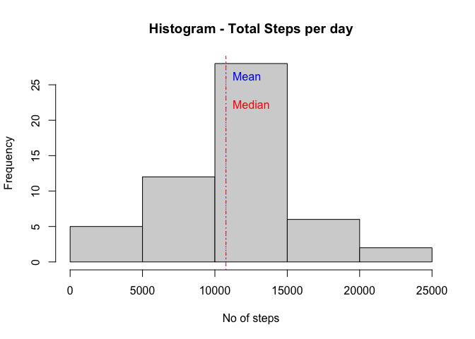
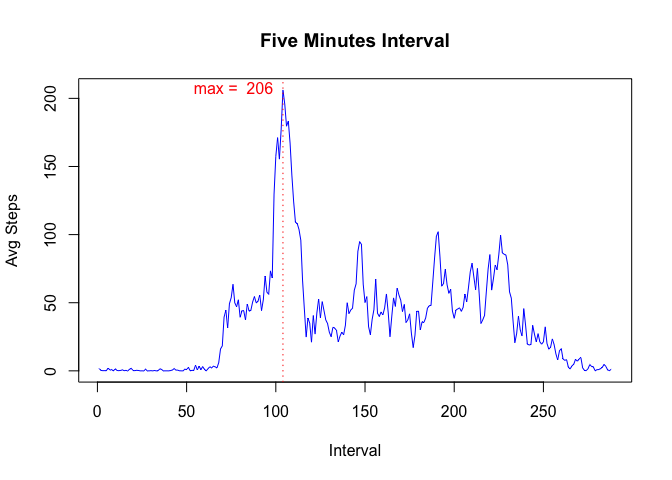
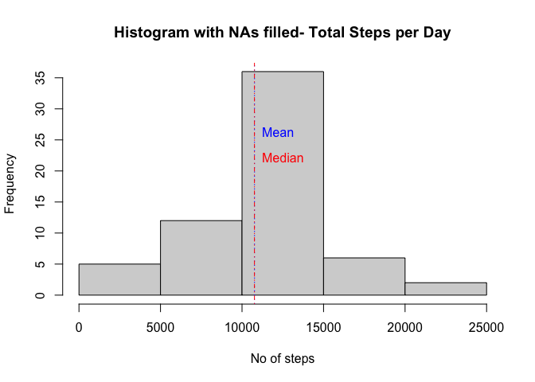
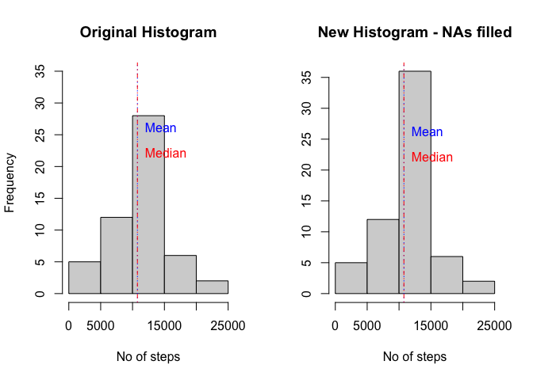
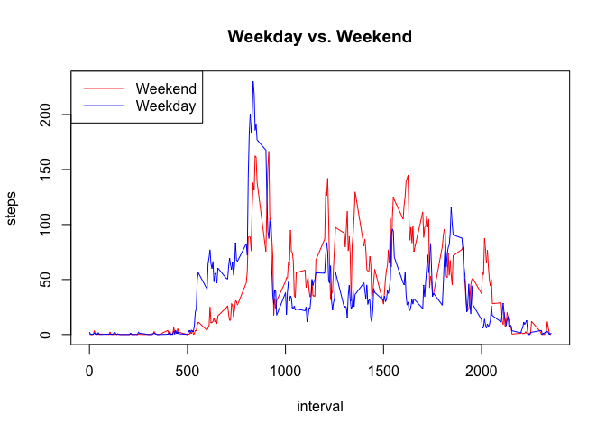

# Reproducible Research: Peer Assessment 1

## Loading and preprocessing the data

First, we load and process the data for analysis.


```r
data <- read.csv(unz("activity.zip","activity.csv"))
```


## What is mean total number of steps taken per day?

We can ignore the missing values in the dataset.
We will make a histogram of the total number of steps taken each day.


```r
nonNAdata <-subset(data, complete.cases(data)==TRUE)
dataByDate <- split(nonNAdata, nonNAdata$date, drop=TRUE)
dailySteps <- sapply(dataByDate, function(x) sum(x$steps))
hist(dailySteps, main="Histogram - Total Steps per day", xlab="No of steps",col="lightgray")
abline(v=mean(dailySteps), lty=3, col="blue")
text(mean(dailySteps),26,labels="Mean", pos = 4, col="blue")
abline(v=median(dailySteps), lty=4, col="red")
text(median(dailySteps),22,labels="Median", pos = 4, col="red")
```

 

##Calculate and report the mean and median total number of steps taken per day


The mean and median are as follows:


```r
summary(dailySteps)
```

```
##    Min. 1st Qu.  Median    Mean 3rd Qu.    Max. 
##      41    8841   10760   10770   13290   21190
```

## What is the average daily activity pattern?

We will make a time series plot (i.e. type = "l") of the 5-minute interval (x-axis) and the average number of steps taken, averaged across all days (y-axis)


```r
dataByInterval <- split(nonNAdata,nonNAdata$interval, drop=TRUE)
avgV <- sapply(dataByInterval, function(x) mean(x$steps))     
plot(avgV, type="l",main="Five Minutes Interval", ylab="Avg Steps", xlab="Interval", col="blue")                          
abline(v=which.max(avgV), lty=3, col="red")
text(which.max(avgV),max(avgV),labels=paste("max = ",as.character(round(max(avgV)))), pos=2, col="red")
```

 

##Which 5-minute interval, on average across all the days in the dataset, contains the maximum number of steps?

To find out, we will get the interval by the name.


```r
names(which.max(avgV))
```

```
## [1] "835"
```

The average number of step is


```r
round(max(avgV))
```

```
## [1] 206
```

The index positon is 


```r
which.max(avgV)
```

```
## 835 
## 104
```


## Imputing missing values

Calculate and report the total number of missing values in the dataset (i.e. the total number of rows with NAs)


```r
originalValue <- complete.cases(data)  

nMissing <- length(originalValue[originalValue==FALSE]) 
```

The number of missing values is:


```r
nMissing
```

```
## [1] 2304
```

## How does the new dataset with NAs filled in with data?

We will make a histogram of the total number of steps taken each day and Calculate and report the mean and median total number of steps taken per day. 


```r
newData <- cbind(data,originalValue)                          
splitByOrig<-split(newData,newData$originalValue, drop=TRUE)  

for (row in 1:nrow(splitByOrig[["FALSE"]])){  
  splitByOrig[["FALSE"]][row,1] <- round(subset(avgV,names(avgV) == as.character(splitByOrig[["FALSE"]][row,3])))
}


newData <- rbind(splitByOrig[["FALSE"]],splitByOrig[["TRUE"]])           
newData <- newData[with(newData, order(date, interval)), ]            
newByDay <- split(newData,newData$date, drop=TRUE)                 

dailyStepsNew <- sapply(newByDay, function(x) sum(x$steps))        
hist(dailyStepsNew, main="Histogram with NAs filled- Total Steps per Day", 
     xlab="No of steps", col="lightgray") 
abline(v=mean(dailyStepsNew), lty=3, col="blue")
text(mean(dailyStepsNew),26,labels="Mean", pos=4, col="blue") 
abline(v=median(dailyStepsNew), lty=4, col="red")
text(mean(dailyStepsNew),22,labels="Median", pos=4, col="red")
```

 

```r
summary(dailySteps)
```

```
##    Min. 1st Qu.  Median    Mean 3rd Qu.    Max. 
##      41    8841   10760   10770   13290   21190
```

```r
summary(dailyStepsNew)
```

```
##    Min. 1st Qu.  Median    Mean 3rd Qu.    Max. 
##      41    9819   10760   10770   12810   21190
```

## Is there a difference with using the original data and the new data that has NAs filled with non empty values?

To compare if there is difference, we will create the two histogram side by side.


```r
par(mfrow=c(1,2))

hist(dailySteps, main="Original Histogram", 
     xlab="No of steps",col="lightgray" , ylim=c(0,35))
abline(v=mean(dailySteps), lty=3, col="blue")
text(mean(dailySteps),26,labels="Mean", pos = 4, col="blue")
abline(v=median(dailySteps), lty=4, col="red")
text(median(dailySteps),22,labels="Median", pos = 4, col="red")

hist(dailyStepsNew, main="New Histogram - NAs filled", 
     xlab="No of steps", col="lightgray", ylab="") 
abline(v=mean(dailyStepsNew), lty=3, col="blue")
text(mean(dailyStepsNew),26,labels="Mean", pos=4, col="blue") 
abline(v=median(dailyStepsNew), lty=4, col="red")
text(mean(dailyStepsNew),22,labels="Median", pos=4, col="red")
```

 

Observation:

There is no change in mean or median with the NAs filled for the new dataset.
However, from the graphs, the change is on the centre bar of values which is correct since we filled the NAs with mean value.


## Are there differences in activity patterns between weekdays and weekends?

We will create a new factor variable in the dataset with two levels, weekday and weekend, indicating whether a given date is a weekday or weekend day.


```r
newData$date <- as.Date(strptime(newData$date, format="%Y-%m-%d")) 
newData$day <- weekdays(newData$date) 

for (i in 1:nrow(newData)) {                                        
  if (newData[i,]$day %in% c("Saturday","Sunday")) {             
    newData[i,]$day<-"weekend"                                 
  }
  else{
    newData[i,]$day<-"weekday"
  }
}
```

Make a panel plot containing a time series plot (i.e. type = "l") of the 5-minute interval (x-axis) and the average number of steps taken, averaged across all weekday days or weekend days (y-axis). 


```r
dataByDay <- aggregate(newData$steps ~ newData$interval + newData$day, newData, mean)
names(dataByDay) <- c("interval", "day", "steps")

par(mfrow=c(1,1))  
with(dataByDay, plot(steps ~ interval, type ="n", main="Weekday vs. Weekend"))  
with(dataByDay[dataByDay$day == "weekend",], lines(steps ~ interval, type="l", col="red" ))  
with(dataByDay[dataByDay$day == "weekday",], lines(steps ~ interval, type="l", col="blue"))  
legend("topleft", lty=c(1,1), legend = c("Weekend", "Weekday"), col = c("red", "blue"), seg.len=3)
```

 

Conclusion:

It seems that there are more steps taken in weekends than weekdays.


